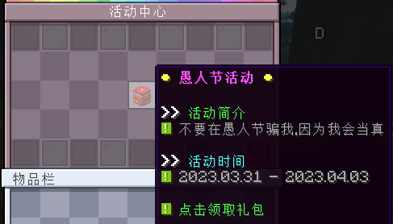

# 🧾 3.27日更新日志 ( v1.2.9 )

<figure><figcaption></figcaption></figure>

**一、新系统 更多矿石**

> 生存、资源、末地、地狱世界分别加入了诸多新型矿石、深层矿石

1、生存、资源世界刷新矿石

* 广寒铁矿石 
  * 生成条件
    * 区块刷新率: 70%
    * 矿物含量: 4
    * 矿脉数量: 7
    * Y轴: `150` - `0`
* 深层广寒铁矿石 
  * 生成条件
    * 区块刷新率: 100%
    * 矿物含量: 6
    * 矿脉数量: 5
    * Y轴: `0` - `-60`
* 广寒铁块 
* 粗广寒铁块 
* 广寒铁粒 
* 广寒铁锭 
* 粗广寒铁 

***

* 孔雀石矿石 
  * 生成条件
    * 区块刷新率: 70%
    * 矿物含量: 4
    * 矿脉数量: 7
    * Y轴: `150` - `0`
* 深层孔雀石矿石 
  * 生成条件
    * 区块刷新率: 100%
    * 矿物含量: 6
    * 矿脉数量: 5
    * Y轴: `0` - `-60`
* 孔雀石块 
* 粗孔雀石块 
* 孔雀石粒 
* 孔雀石锭 
* 粗孔雀石 

***

* 紫晶石矿石 
  * 生成条件
    * 区块刷新率: 70%
    * 矿物含量: 4
    * 矿脉数量: 7
    * Y轴: `150` - `0`
* 深层紫晶石矿石 
  * 生成条件
    * 区块刷新率: 100%
    * 矿物含量: 6
    * 矿脉数量: 5
    * Y轴: `0` - `-60`
* 紫晶石块 
* 粗紫晶石块 
* 紫晶石粒 
* 紫晶石锭 
* 粗紫晶石 

***

* 琥珀矿石 
  * 生成条件
    * 区块刷新率: 70%
    * 矿物含量: 4
    * 矿脉数量: 7
    * Y轴: `150` - `0`
* 深层琥珀矿石 
  * 生成条件
    * 区块刷新率: 100%
    * 矿物含量: 6
    * 矿脉数量: 5
    * Y轴: `0` - `-60`
* 琥珀块 
* 粗琥珀块 
* 琥珀粒 
* 琥珀锭 
* 粗琥珀 

***

* 翡翠矿石 
  * 生成条件
    * 区块刷新率: 50%
    * 矿物含量: 2
    * 矿脉数量: 3
    * Y轴: `150` - `20`
* 深层翡翠矿石 
  * 生成条件
    * 区块刷新率: 50%
    * 矿物含量: 3
    * 矿脉数量: 5
    * Y轴: `20` - `-60`
* 翡翠块 
* 粗翡翠块 
* 翡翠粒 
* 翡翠锭 
* 翡翠 

***

* 银矿石 
  * 生成条件
    * 区块刷新率: 70%
    * 矿物含量: 4
    * 矿脉数量: 7
    * Y轴: `150` - `0`
* 深层银矿石 
  * 生成条件
    * 区块刷新率: 100%
    * 矿物含量: 6
    * 矿脉数量: 5
    * Y轴: `0` - `-60`
* 银块 
* 粗银块 
* 银粒 
* 银锭 
* 粗银 

***

2、地狱世界刷新矿石

* 红宝石矿石 
  * 生成条件
    * 区块刷新率: 50%
    * 矿物含量: 2
    * 矿脉数量: 4
    * Y轴: `115` - `60`
* 深层红宝石矿石 
  * 生成条件
    * 区块刷新率: 50%
    * 矿物含量: 4
    * 矿脉数量: 6
    * Y轴: `60` - `5`
* 红宝石块 
* 粗红宝石块 
* 红宝石粒 
* 红宝石锭 
* 红宝石 

***

3、末地世界刷新矿石

* 铱矿石 
  * 生成条件
    * 区块刷新率: 50%
    * 矿物含量: 4
    * 矿脉数量: 7
    * Y轴: `115` - `60`
* 深层铱矿石 
  * 生成条件
    * 区块刷新率: 50%
    * 矿物含量: 6
    * 矿脉数量: 5
    * Y轴: `60` - `5`
* 铱块 
* 粗铱块 
* 铱粒 
* 铱锭 
* 粗铱 

***

**二、新系统 烹饪系统**

> 畅想大厨生涯了嘛！

1、新道具

* **烹饪锅**
  * 瘾流宝店 > 食物商城购买
  * 售价: 500 /个
* 食谱
  * 嘿嘿，自己摸索去把！只要是生的可能都值得一试哈哈哈
  * 一次烹饪只能放置 2 种食材 (仅限原版)
  * 在一段时间后 成功与否！天做主了
  * ~~不死心的可以找服主购买食谱~~

***

**三、新界面 铭牌**

此次更新在 菜单 > 个人功能 处新增了 **铭牌系统按钮**，点击可以进行铭牌预览、更换

四、新物品 情人火箭

> 等收件人上线后看到了 ~~我套死你！~~

* 情人火箭
  * 特殊物品商城购买
  * 售价: 50 /个

<figure><figcaption></figcaption></figure>

<figure><figcaption></figcaption></figure>
